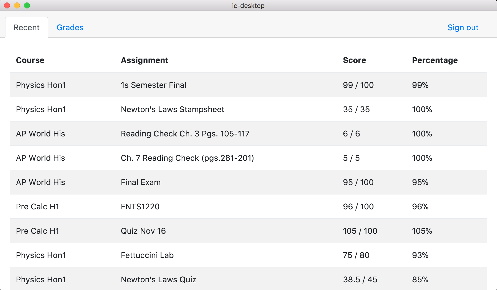
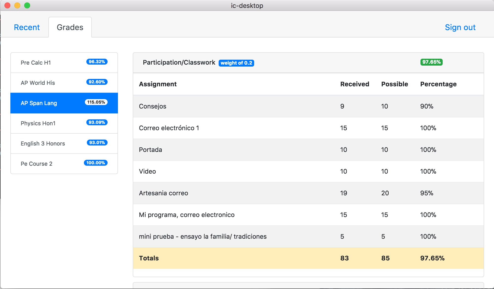

# ic-desktop

> Desktop client for InfiniteCampus

[](https://ci.appveyor.com/project/aaronduino/ic-desktop)
[](https://travis-ci.org/aaronduino/ic-desktop)





#### Build Setup

``` bash
# install dependencies
npm install

# serve with hot reload at localhost:9080
npm run dev

# build electron application for production
npm run build

# run unit & end-to-end tests
npm test


# lint all JS/Vue component files in `src/`
npm run lint

```

---

This project was generated with [electron-vue](https://github.com/SimulatedGREG/electron-vue)@[1c165f7](https://github.com/SimulatedGREG/electron-vue/tree/1c165f7c5e56edaf48be0fbb70838a1af26bb015) using [vue-cli](https://github.com/vuejs/vue-cli). Documentation about the original structure can be found [here](https://simulatedgreg.gitbooks.io/electron-vue/content/index.html).
